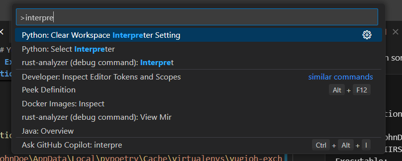
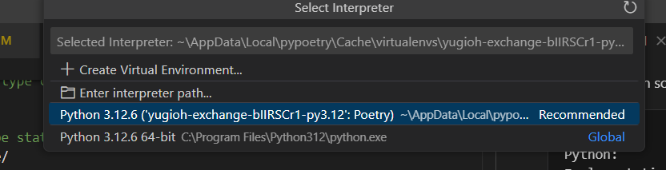
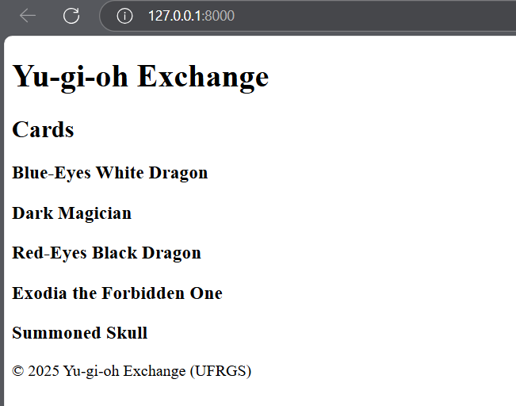

# Yu-Gi-Oh Exchange

Project for the Software Engineering Course - UFRGS 2025/1.

Assignment 2 - Design and implement use cases from another group, based on their requirements document.

Group members:

- [Guilherme C](https://github.com/)
- [Guilherme S](https://github.com/GuilhermeMerlini)
- [Matheus F](https://github.com/matheusrodf)
- [Richard R](https://github.com/Wlisk)

---
---

## Descrição

Build a web application to exchange Yu-Gi-Oh cards.

This project consists of a Django application and a FastAPI service on the background.

The Django is use to serve the html (view) and control business logic.

The FastAPI service is used to control the database and serve data to the Django app. Though it grows the project in complexity, it facilitates maintenance and others aspects.

---
---

## Instalation and Setup

This projects use [Poetry](https://python-poetry.org/) for package management. To install it:

```bash
pipx install poetry
```

The command above will add poetry into the terminal context so we can use it.

In the terminal we enter the project dir to execute the commands that will be followed.

First we configure where the virtual environment will be placed. In our case we prefer it to be placed in our project root dir inside the .venv folder. We do this by executing the command:

```bash
poetry config virtualenvs.in-project true --local
```

Now we need to install all depencies in pyproject.toml:

```bash
poetry install
```

Now open the project root folder with any editor that is capable to switch its python interpreter, in this case I will be using VSCode.

By installing all the project dependecies using poetry it will add everything by default into a python virtual environment.

To enter in this environment in the terminal we need to first find the python interpreter created for this project.

To find it we execute:

```bash
poetry env info
```

And it will return something like this:

```bash
Virtualenv
Python:         3.12
Implementation: CPython
Path:           C:\Users\JohnDoe\Projects\yugioh_exchange\.venv
Executable:     C:\Users\JohnDoe\Projects\yugioh_exchange\.venv\Scripts\python.exe
Valid:          True

Base
Platform:   win32
OS:         nt
Python:     3.12
Path:       C:\Program Files\Python312
Executable: C:\Program Files\Python312\python.exe
```

The interpreter path is in the 'Executable' line.

Now with the path to the interpreter found we can copy it, or find it with a folder picker, and change the python interpreter of the project in the VSCode editor.

In VSCode we can ise the command [ctrl + shift + p] and type 'interpreter' so we can select [Python: Select Interpreter]. It should look like this:



And then we can click on [Enter interpreter path] to find in the folder picker or paste the path we find earlier.



With this our VSCode is now ready to lint correctly the packages in the code.

With the editor set now we can start our services.

As the api server is still "terminal executed" we execute it with the command in the terminal:

```bash
poetry run uvicorn api.main:app --port 8001 --reload
```

This way our db server (FastAPI) is being executed in the foreground at port 8001. We can access it by going to [http://127.0.0.1:8001/](http://127.0.0.1:8001/).

Now we need to execute our view server (Django) with the command:

```bash
poetry run python webserver/manage.py runserver
```

This way our view server will be executed in the foreground at port 8000. We can access it by going to [http://127.0.0.1:8000/](http://127.0.0.1:8000/).

With all setup and servers running or start application should look like this:


